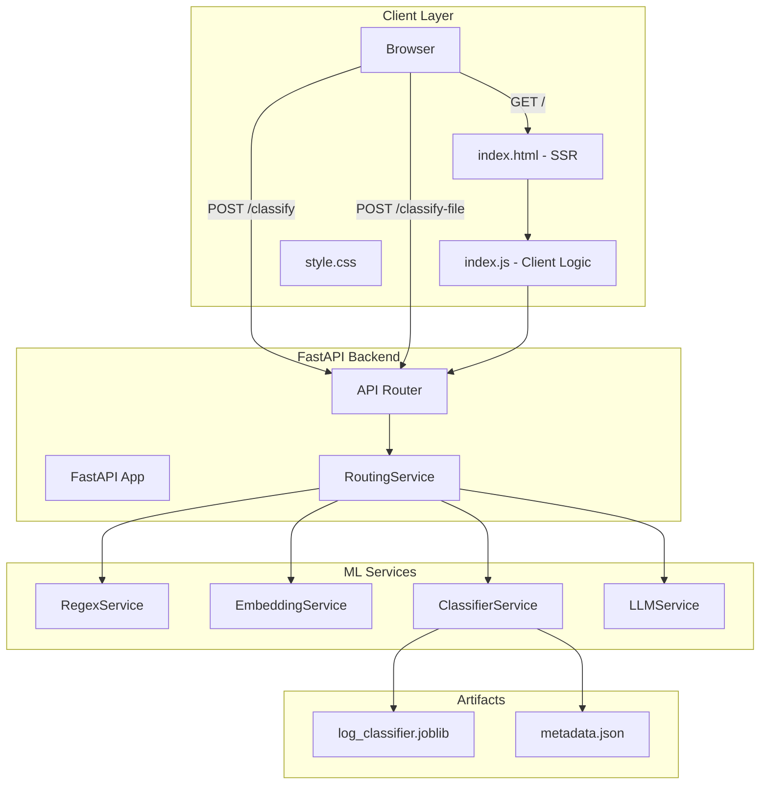

# **LogIQ: Hyrid ML Log Classifier**

A **high-performance, cost-optimized** log classification system combining **regex, sentence embeddings, ML, and LLM fallback (Groq/Llama)** for **sub-300ms latency** and **70-80% LLM cost reduction**.

---


---

## **Table of Contents**
- [How It Works](#how-it-works)
- [ML/NLP Architecture](#mlnlp-architecture)
- [System Architecture](#system-architecture)
- [Deployment](#deployment)
- [Getting Started](#getting-started)

---

## **How It Works**
### **3-Tier Hybrid Pipeline**
1. **Regex** → Fast, rule-based matching
2. **ML (Sentence Transformer + Logistic Regression)** → Semantic classification
3. **LLM (Groq/Llama)** → Fallback for ambiguous logs

**Key Features:**
- **Sub-300ms latency** (ML path)
- **Confidence-aware routing** (auto-fallback to LLM)
- **Batch CSV processing** (streaming, memory-efficient)
- **Production-ready** (FastAPI + Docker)

---

## **ML/NLP Architecture**

| **Component**       | **Technology**               | **Purpose**                          |
|---------------------|-----------------------------|--------------------------------------|
| Regex               | Python `re`                 | Fast rule-based classification       |
| Embeddings          | `all-MiniLM-L6-v2`          | Log → 384-dim semantic vector        |
| Classifier          | Scikit-learn LR             | Probabilistic log categorization     |
| LLM Fallback        | Groq (`llama-3.1-8b`)       | Context-aware classification         |


## **System Architecture**




## Backend & Infrastructure

### **FastAPI (ASGI, Async)**

* High-performance ASGI framework
* Async support for LLM API calls and file uploads
* Pydantic-based request validation
* Server-Side Rendering (Jinja2) + REST API
* Auto-generated OpenAPI docs (`/docs`)

---

### **Gunicorn + Uvicorn (Production Runtime)**

* Gunicorn manages worker processes
* Uvicorn runs the ASGI event loop
* Graceful restarts and container-friendly signal handling

**Scaling model:**

* 1 worker per container (ML models are memory-heavy)
* Scale horizontally via container replicas

---

### **Modular Service Architecture (Dependency Injection)**

Clean separation of layers:

* **API Router** → request validation & response formatting
* **RoutingService** → pipeline orchestration
* **Regex / ML / LLM Services** → independent classification strategies

This enables:

* Easy testing
* Replaceable components
* Clear separation of concerns

---

### **Containerization & Config**

* Python 3.12-slim
* `uv` + lockfile for deterministic installs
* Non-root runtime user
* Environment-driven configuration (`.env` / Docker `--env-file`)
* No secrets baked into image

---

### **Scalability Strategy**

* Stateless API design
* Horizontal scaling via container replication
* Confidence-based routing to reduce LLM cost

---

## **Deployment**
### **Docker Setup**
```bash
# Build
docker build -t logiq .

# Run (CPU)
docker run -p 8000:8000 --env-file .env logiq

# Run (GPU)
docker run --gpus all -p 8000:8000 --env-file .env logiq
```

**Environment Variables:**
| **Variable**            | **Default**               | **Description**                     |
|-------------------------|---------------------------|-------------------------------------|
| `GROQ_API_KEY`          | *(required)*              | Groq API key                        |
| `CONFIDENCE_THRESHOLD`  | `0.5`                     | ML confidence cutoff                |
| `EMBEDDING_MODEL_NAME`  | `all-MiniLM-L6-v2`        | HuggingFace model ID                |

---

## **Getting Started**
### **Quick Test**
```bash
curl -X POST http://localhost:8000/classify \
  -H "Content-Type: application/json" \
  -d '{"log_text": "ERROR: Database timeout"}'
```
**Response:**
```json
{****
  "label": "CONNECTIVITY_ERROR",
  "confidence": 0.85,
  "method": "embedding_classifier"
}
```

### **Prerequisites**
- Python 3.10+
- Groq API key ([console.groq.com](https://console.groq.com))
- Docker (optional)

---
## Implementation Status

- [x] Core classification pipeline
- [x] Docker + FastAPI setup
- [ ] Health checks + rate limiting *(High)*
- [ ] Batch optimization *(Medium)*
